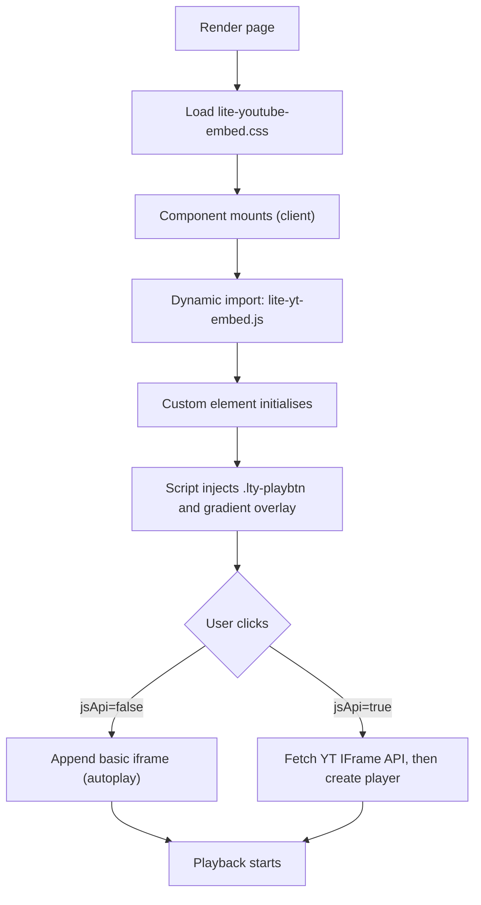

# Mine Seek lite‑youtube‑embed Integration Guide

## Overview

The Extractor Grid demo page uses Paul Irish’s `lite-youtube-embed` to render a fast, privacy‑friendly YouTube facade that defers the heavy iframe until interaction. Our implementation adds robust CSS to ensure the play overlay reliably displays alongside Mine Seek’s styling and Tailwind resets. Upstream reference: [lite‑youtube‑embed](https://github.com/paulirish/lite-youtube-embed).

<important_note>

> 📝 NOTE: This guide documents the current Mine Seek implementation of the `lite-youtube-embed` custom element only. It omits unrelated options from the upstream project.

</important_note>

---

## File Structure

```
src/app/extractor-grid/
├── LiteYouTubeEmbed.jsx    # Client component that initialises <lite-youtube>
└── page.jsx                # Uses LiteYouTubeEmbed inside an aspect-ratio box

public/
└── lite-youtube-embed.css  # Overlay, poster, and play button styles (hardened)
```

---

## Configuration & Usage

- **Import and place inside a 16:9 container** (e.g. Tailwind’s `aspect-video`).
- **CSS must load before initialisation** so the play overlay remains visible.
- **Poster override** is optional; if provided, it is respected by the custom element.

```jsx
// src/app/extractor-grid/page.jsx
<LiteYouTubeEmbed
  videoid="qGk6nN2uFWg"
  title="Mine Seek Extractor Grid Demo"
  playlabel="Play demonstration video: See how Extractor Grid structures geological data"
  params="controls=1&modestbranding=2&enablejsapi=1"
  jsApi={true}
  style={{ backgroundImage: 'url(/screenshots/extractor-table.png)' }}
/>
```

### Component Props (current implementation)

| Prop | Type | Required | Description |
|------|------|----------|-------------|
| `videoid` | string | Yes | YouTube video id. |
| `title` | string | No | Visible text overlay before activation; also used for A11y label. |
| `playlabel` | string | No | Screen‑reader label for the play button. |
| `params` | string | No | Query string for YouTube Player (merged with defaults `modestbranding=1&rel=0&start=0`). |
| `jsApi` | boolean | No | If true, enables IFrame Player API path on activation. |
| `style.backgroundImage` | string | No | Poster override; respected by the element and not overwritten. |

---

## Implementation Details (Mine Seek)

- **Client component** creates the custom element and dynamically imports the script:
  - `await import('lite-youtube-embed/src/lite-yt-embed.js')`
  - Runs after mount with a brief defer to keep critical content fast.
- **CSS loading**: loaded immediately in `LiteYouTubeEmbed.jsx` via a normal `<link rel="stylesheet" href="/lite-youtube-embed.css" />` to avoid timing races.
- **Hardened play overlay** in `public/lite-youtube-embed.css`:
  - `.lty-playbtn { position: absolute; inset: 0; }` for full‑area click target.
  - Forced icon via `background-image: data-URL !important` to survive Tailwind’s button resets.

---

## Workflow



---

## Troubleshooting & Points of Error

- **Play button not visible**
  - Cause: CSS race or Tailwind reset removing `background-image` from `.lty-playbtn`.
  - Fix: Ensure `/lite-youtube-embed.css` loads immediately; keep `.lty-playbtn` rules with `position:absolute; inset:0;` and the data‑URL `background-image !important`.

- **No element appears**
  - Cause: Script not imported or component not marked as client.
  - Fix: Keep `'use client'` and the dynamic `import('lite-youtube-embed/src/lite-yt-embed.js')` in an effect after mount.

- **Poster doesn’t use custom image**
  - Ensure `style={{ backgroundImage: 'url(/path.jpg)' }}` is applied on the component; the custom element won’t overwrite if already set.

- **Need programmatic control**
  - Enable `jsApi={true}`. After activation, obtain the player via the exposed helper attached to the container:
    ```js
    const player = await containerRef.current.getYTPlayer()
    player.seekTo(30)
    ```

---

## References

- Upstream project and usage notes: [lite‑youtube‑embed](https://github.com/paulirish/lite-youtube-embed)
