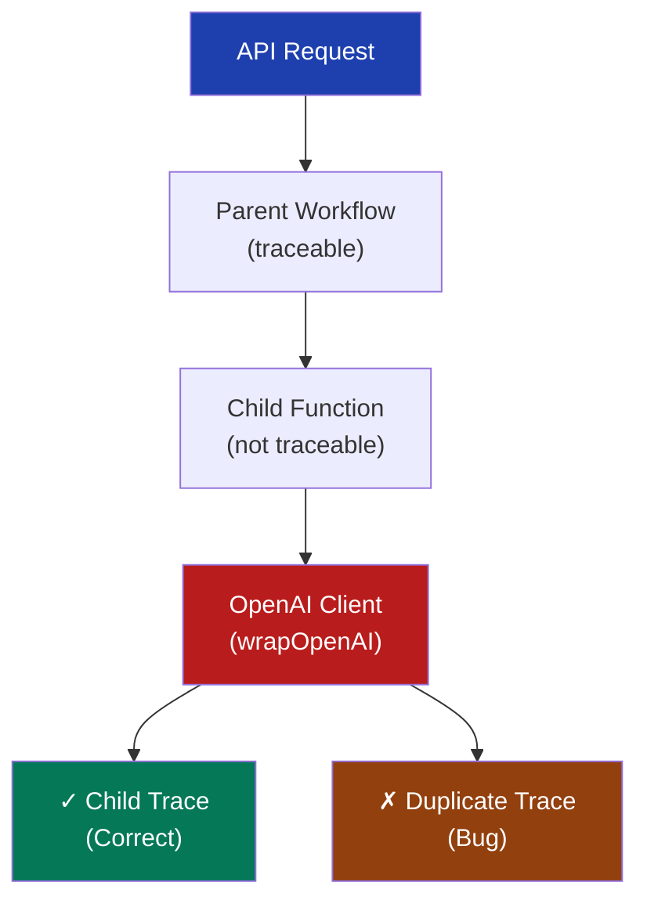

# Error Documentation Template

<!-- ════════════════════════════════════════════════════════════════════════════════
     🚨 TEMPLATE METADATA - DELETE THIS ENTIRE SECTION WHEN USING THE TEMPLATE 🚨
     ════════════════════════════════════════════════════════════════════════════════ -->

## What This Template Is

This is a structured template for documenting errors, bugs, and technical issues in software systems. It provides a comprehensive framework to systematically analyze problems, document investigation attempts, and guide future debugging efforts. The template emphasizes high information density and actionable details to accelerate issue resolution.

Unless otherwise specified, save details of a specific error created using this template to the `documents/todo/errors` folder.
---

## Template Usage Notes

<important_note>

> 📝 **NOTE:** This template is designed for documenting unsolved errors to hand off to other team members or for future reference. Focus on observable facts and attempted solutions rather than speculation.

</important_note>

### When to Use This Template

- Documenting persistent errors you cannot solve
- Creating handoff documentation for another developer
- Recording complex debugging investigations
- Building a knowledge base of known issues
- Preparing escalation documentation

### Required Sections (Never Skip)

1. Goal
2. Current State
3. Desired State
4. Problem Statement
5. Evidence from Logs/Monitoring

### Optional Sections (EXCLUDE Completely If Not Relevant)

**Important: Optional sections should be completely removed from your document if they don't apply. Do NOT include them with "None provided" or placeholder content.**

- Affected Code Analysis (if source code identified)
- Previous Fix Attempts (if you've tried solutions)
- Workaround (if temporary solution exists)
- Next Investigation Steps (if you have specific recommendations)
- References (if external resources consulted)
- Root Cause Analysis (only if explicitly requested)

<critical_warning>

> 🚨 **TEMPLATE MISUSE:** Never include optional sections with placeholder content like "None provided" or "N/A". This confuses readers and reduces document quality. If a section doesn't apply, delete it entirely.

</critical_warning>

---

## Information Highlighting Guidelines

Use XML tags with proper spacing to highlight critical information specific to error documentation.

**Data Loss Risk**
```markdown
<critical_warning>

> 🚨 **DATA LOSS RISK:** This error can cause permanent data loss or corruption. Immediate action required.

</critical_warning>
```

**Security Implications**
```markdown
<critical_warning>

> 🚨 **SECURITY:** This issue exposes sensitive data or creates security vulnerabilities.

</critical_warning>
```

**Known Workaround**
```markdown
<important_note>

> 📝 **WORKAROUND:** Temporary solution available—see Workaround section for implementation details.

</important_note>
```

**Investigation Status**
```markdown
<important_note>

> 📝 **STATUS:** Investigation incomplete. Handing off to [team/person] for further analysis.

</important_note>
```

---

## Prohibitions

**This error documentation template explicitly excludes:**

✘ **No dates or timestamps** - Avoid "first observed", "date updated", specific dates, or any temporal references  
✘ Avoid speculation—document only observable facts and attempted solutions  
✘ Skip detailed code solutions—focus on problem documentation for handoff  
✘ Eliminate time estimates, resolution deadlines, or "urgency" classifications  
✘ Do not include assignment to specific team members or escalation paths

---
<!-- ════════════════════════════════════════════════════════════════════════════════
     🚨 END OF TEMPLATE METADATA - DELETE EVERYTHING ABOVE THIS LINE 🚨
     ════════════════════════════════════════════════════════════════════════════════ -->

## 1. Goal

State the ideal system behavior in ≤ 3 sentences. Focus on what should happen when functioning correctly, not what's currently broken.

> **Example**  
> "Create unified parent-child trace hierarchies in LangSmith where each document processing operation generates exactly one trace containing all child operations. Individual functions should appear as child runs within single parent traces rather than as separate independent traces."

### Observable Symptoms

| Symptom | Frequency | Conditions | Severity |
|---------|-----------|------------|----------|
| Duplicate traces in monitoring | 100% reproducible | All API calls | High |
| Memory leak in worker process | Intermittent (~30%) | High load only | Medium |

### Error Messages

```
# Include exact error messages, stack traces, or console output
Error: Connection refused at localhost:6379
Stack trace:
  at RedisClient.connect (redis.js:143:15)
  at async WorkerProcess.initialize (worker.js:23:5)
```

---

## 2. Current State

Describe the actual behavior with specific, observable symptoms. Include frequency, conditions, and any patterns.

### Observable Symptoms

| Symptom | Frequency | Conditions | Severity |
|---------|-----------|------------|----------|
| Duplicate traces in monitoring | 100% reproducible | All API calls | High |
| Memory leak in worker process | Intermittent (~30%) | High load only | Medium |

### Error Messages

```
# Include exact error messages, stack traces, or console output
Error: Connection refused at localhost:6379
Stack trace:
  at RedisClient.connect (redis.js:143:15)
  at async WorkerProcess.initialize (worker.js:23:5)
```

---

## 3. Desired State

Clearly define the expected behavior when the issue is resolved. Be specific about success criteria.

> **Example**
> - Single parent trace per operation
> - All child operations nested within parent
> - No duplicate or orphaned traces
> - Complete operation visibility in single view

---

## 4. Problem Statement

### Summary

Provide a concise problem description in 1-2 paragraphs, focusing on impact and scope.

### Technical Details

| Aspect | Description |
|--------|-------------|
| **Error Type** | Race condition / Memory leak / Logic error / Configuration |
| **Affected Components** | List specific services, modules, or functions |
| **Trigger Conditions** | User actions or system states that cause the error |
| **Impact Scope** | Percentage of users/operations affected |

### Environment Details

```yaml
# Include relevant environment configuration
Runtime: Node.js 20.18.1
Framework: Express 4.18.2
Database: PostgreSQL 14.5
Key Libraries:
  - langsmith: 0.3.30
  - openai: 5.0.1
Deployment: Heroku (2 web dynos, 1 worker)
```

---

## 5. Evidence from Logs/Monitoring

### Log Analysis

```
# Include relevant log excerpts with generic timestamps
[timestamp] [express] POST /api/documents/upload 200 in 192ms
[timestamp] Starting image processing workflow for document ID: 188
[timestamp] Phase 1: Processing OCR within workflow...
[timestamp] ERROR: Duplicate trace created for ChatOpenAI
```

### Metrics/Monitoring Data

| Metric | Normal Range | During Error | Impact |
|--------|--------------|--------------|--------|
| Response Time | 200-500ms | 2000-5000ms | 10x slower |
| Error Rate | <0.1% | 15% | Service degradation |
| Memory Usage | 200-300MB | 450-512MB | OOM crashes |

---

## 6. Affected Code Analysis (Optional)

### File Structure
```
project_root/
├── server/
│   ├── services/
│   │   └── openai.ts          # Contains wrapped OpenAI client
│   └── routes.ts              # Workflow definitions with trace issues
└── shared/
    └── types.ts               # Type definitions
```

### Code Examination

#### Current Implementation
```typescript
// File: server/services/openai.ts
// Lines: 15-20
// Issue: wrapOpenAI creates duplicate trace contexts

const openai = wrapOpenAI(
  new OpenAI({
    apiKey: process.env.OPENAI_API_KEY,
  }) as any
);
```

#### Call Flow Analysis


---

## 7. Previous Fix Attempts (Optional)

Document all attempted solutions chronologically, including why each failed.

| Attempt # | Approach | Result | Why It Failed |
|-----------|----------|--------|---------------|
| 1 | Remove traceable wrapper | Lost child visibility | Over-correction |
| 2 | Add explicit context passing | No change | Context already present |
| 3 | Downgrade library version | Broke other features | Dependency conflicts |

### Lessons Learned

- [Key insight from failed attempt]
- [Pattern to avoid in future fixes]

---

## 8. Current Workaround (Optional)

<critical_warning>

> 🚨 **TEMPORARY:** This workaround has limitations. See constraints below.

</critical_warning>

### Implementation

```bash
# Step-by-step workaround instructions
1. Set environment variable: DISABLE_DUPLICATE_TRACES=true
2. Restart worker processes
3. Monitor for side effects
```

### Workaround Constraints

| Constraint | Impact | Acceptable For |
|------------|--------|----------------|
| Reduces observability | 30% less trace detail | Development only |
| Performance overhead | +100ms latency | Low-traffic periods |

---

## 9. Next Investigation Steps (Optional)

Prioritized list of debugging actions for whoever takes over this issue:

1. **[High Priority]** Check AsyncLocalStorage context propagation
   - Test with `LANGSMITH_TRACING_BACKGROUND=false`
   - Monitor context ID consistency

2. **[Medium Priority]** Analyze library internals
   - Review wrapOpenAI source code
   - Check for multiple initialization points

3. **[Low Priority]** Environmental factors
   - Test in isolated environment
   - Compare dev vs production behavior

---

## 10. References (Optional)

### Internal Documentation
- [Link to related docs with descriptions]
- `documents/guides/system_architecture.md` - Overall system design

### External Resources
- [GitHub Issues, Stack Overflow, vendor docs]
- LangSmith SDK Issue #123 - Similar duplicate trace problem

### Related Errors
- [Links to similar issues in your system]
- `documents/errors/redis_connection_timeout.md` - May be related

---

## 11. Root Cause Analysis (Optional - ONLY If Explicitly Requested)

<important_note>

> 📝 **NOTE:** Complete this section ONLY if you have been explicitly asked to provide root cause analysis. Otherwise, focus on documenting observable symptoms and attempted solutions since the default goal is to DESCRIBE the issue in depth; not to formulate a solution.

</important_note>

### Confirmed Root Cause

[Describe the fundamental reason for the error, supported by evidence]

### Contributing Factors

1. **Primary**: [Main cause with evidence]
2. **Secondary**: [Additional factors that worsen the issue]
3. **Environmental**: [Context-specific contributors]

---