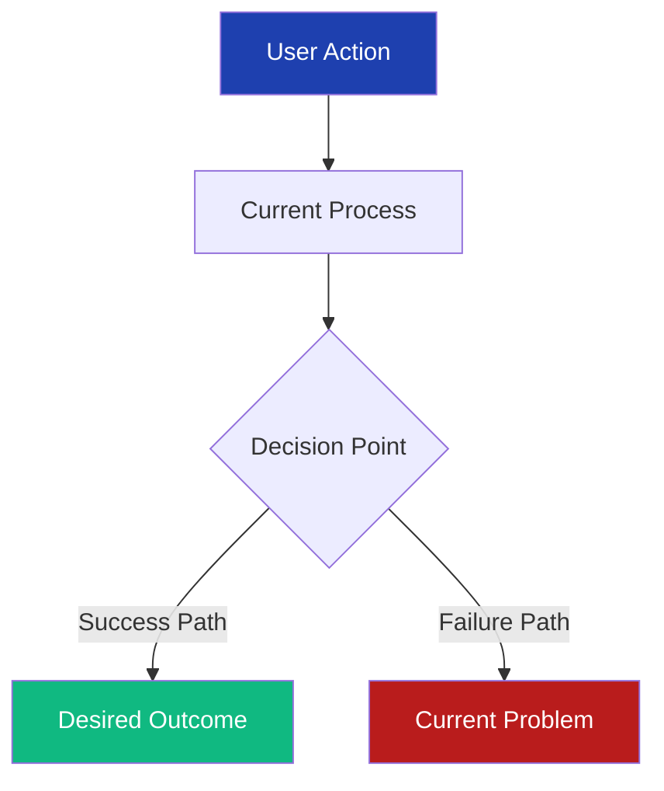
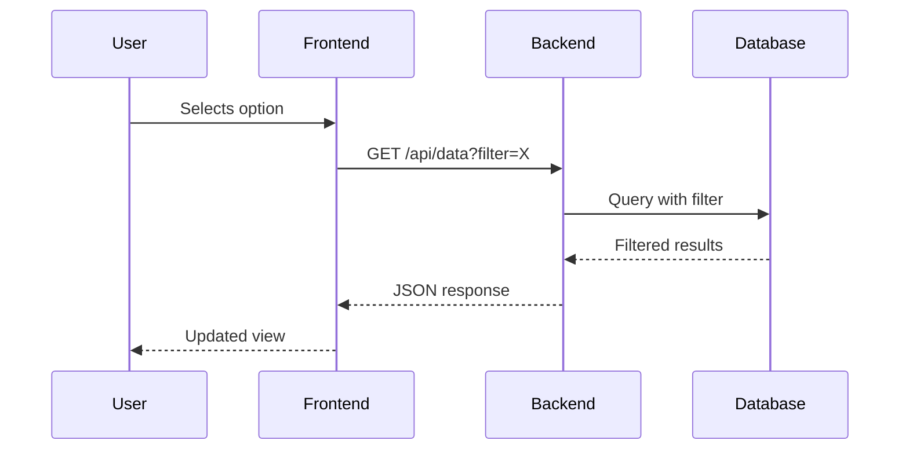

# Planning New Feature Template

<!-- ════════════════════════════════════════════════════════════════════════════════
     🚨 TEMPLATE METADATA - DELETE THIS ENTIRE SECTION WHEN USING THE TEMPLATE 🚨
     ════════════════════════════════════════════════════════════════════════════════ -->

## What This Template Is

This is a structured template for planning new features in software development projects. It provides a comprehensive framework to systematically analyze current state, plan implementation phases, anticipate risks, and coordinate across teams. The template is adaptive—use only applicable sections while maintaining high information density to ensure nothing critical is overlooked.

IMPORTANT: Unless otherwise specified, when you are presented with this template, save details of a new feature created using this template to the `documents/todo/` folder as a new markdown file using the `edit_file` tool.

---

## Template Usage Notes

<important_note>

> 📝 **NOTE:** Remove sections not applicable to your feature. Add feature-specific sections as needed. Maintain information density—every section should provide actionable details.

</important_note>

<critical_warning>

> 🚨 **CRITICAL GUIDANCE:** The Goal and Current State Analysis sections are the MOST IMPORTANT parts of your plan. These sections should be comprehensive and detailed. Implementers need to fully understand WHAT problem you're solving and WHY before they care about HOW. This way if the implementation changes due to bugs or other issues, the implementer can ensure that any deviations from the plan still achieve the same goal.

</critical_warning>

### When to Use This Template

- Planning new features requiring cross-functional changes
- Refactoring existing features with breaking changes  
- Implementing complex user-facing functionality

### Required Sections (Never Skip)

1. **Goal** - The "why" of your feature (MOST CRITICAL)
2. **Current State Analysis** - The complete problem description (MOST CRITICAL)
3. **Implementation Plan** - High-level approach (not line-by-line code)
4. **Testing Plan** - How to verify success

### Section Importance Hierarchy

| Section | Importance | Purpose |
|---------|------------|---------|
| Goal | ⭐⭐⭐⭐⭐ | Define success so implementer can adapt while achieving same outcome |
| Current State | ⭐⭐⭐⭐⭐ | Complete context for autonomous decision-making during implementation |
| Implementation | ⭐⭐⭐ | Suggested approach (may change based on discoveries) |
| Testing | ⭐⭐⭐ | Key scenarios to validate success |
| API/DB/UI | ⭐⭐ | Technical contracts if applicable |

### Optional Sections (EXCLUDE Completely If Not Relevant)

**Important: Optional sections should be completely removed from your document if they don't apply. Do NOT include them with "None provided", "N/A", or "Not applicable". This confuses readers and reduces document quality. If a section doesn't apply, delete it entirely from your document.**

- API Changes (if modifying endpoints)
- Database Changes (if schema modifications)
- UI/UX Changes (if user-facing)

### Information Highlighting Guidelines

Use XML tags with proper spacing to highlight critical information specific to feature planning.

**Breaking Changes**
```markdown
<critical_warning>

> 🚨 **BREAKING CHANGE:** This modification will break existing functionality or require coordinated deployment across multiple services.

</critical_warning>
```

**Implementation Dependencies**
```markdown
<important_note>

> 📝 **DEPENDENCY:** This step must be completed before proceeding to the next phase or will block other development work.

</important_note>
```

### Template Prohibitions

**This planning template explicitly excludes:**

✘ **No dates or timestamps** - Avoid "first observed", "date updated", specific dates, or any temporal references  
✘ Avoid speculation—document only concrete implementation details  
✘ Skip unit-test specifics; reference test files if needed  
✘ Eliminate redundant explanations—say it once, clearly and completely (except for critical warnings or points of failure that require emphasis)  
✘ Do **not** include the following sections:
  - Edge Cases & Error Handling (unless critical to feature)
  - Performance Tests (load testing, benchmarks)
  - Rollout Strategy (feature flags, phased deployments)  
  - Performance Considerations (caching, optimization)
  - Estimated Timeline (time estimates, resource allocation, "days". Just phases/steps; not time estimates)
  - Success Metrics (KPIs, adoption targets)
  - Future Enhancements (roadmap items, wishlist features)

---
<!-- ════════════════════════════════════════════════════════════════════════════════
     🚨 END OF TEMPLATE METADATA - DELETE EVERYTHING ABOVE THIS LINE 🚨
     ════════════════════════════════════════════════════════════════════════════════ -->

## 1. Goal

<important_note>

> 📝 **GUIDANCE:** This section should comprehensively explain WHAT you're trying to achieve and WHY it matters. The implementer should understand the complete problem context and desired outcome so they can make intelligent decisions if the suggested implementation needs to change.

</important_note>

- Clearly articulate the primary objective and the problem being solved
- Explain the user pain points this addresses
- Describe the expected outcome and how success will be measured
- Include any critical context about why this solution approach was chosen

> **Example**  
> "Enable users to access their Performance Dashboard even when cache is missing by triggering on-demand background pre-computation with real-time progress updates. This solves the timeout deadlock where users cannot view their dashboard without re-uploading files, providing a seamless experience that communicates clearly while ensuring eventual success."

---

## 2. Current State Analysis

<critical_warning>

> 🚨 **THIS IS THE MOST IMPORTANT SECTION:** Provide comprehensive context about the current implementation, the problem, and all affected scenarios. The implementer should have enough information to make intelligent pivots if technical realities require changes to the suggested approach. Think of this as their decision-making handbook.

</critical_warning>

### 2.1 Current Implementation Overview

**Describe how the system currently works:**
- Architecture and technical flow
- Key components and their interactions
- Normal operation vs. failure modes
- Any relevant historical context

### 2.2 Current Flow

**Visualize the current system behavior that needs to change:**



### 2.3 The Core Problem

**Detail the specific problem with clear cause and effect:**
- What breaks and when
- Why it breaks (technical root cause)
- Impact on users (with specific examples)
- Current workarounds (if any)

### 2.4 Affected User Scenarios

**List ALL scenarios where users encounter this problem:**
- Include specific user examples if possible
- Describe the user journey for each scenario
- Quantify impact (how many users, how often)
- Note any temporary solutions users employ

### 2.5 Technical Constraints

**Document all limitations affecting the solution:**
- Infrastructure constraints (timeouts, memory, etc.)
- Technology limitations
- Business rules that must be maintained
- Integration points that cannot change

### 2.6 Existing Infrastructure That Can Be Reused

**Identify what's already built that can help:**
- Existing patterns or frameworks
- Reusable components
- Similar implementations elsewhere
- Available tools and libraries

---

## 3. Implementation Plan

<important_note>

> 📝 **REMEMBER:** Focus on WHAT each step achieves and WHY, not HOW to code it. The implementation details may change, but the objectives should remain constant.

</important_note>

### Step 1: [Component/Module Name]

**Objective:** Clear description of what this step achieves and why it's necessary

#### 1.1 High-Level Approach

- Describe the conceptual approach
- List key files/modules to modify (with paths)
- Explain critical decisions or trade-offs
- Note any assumptions that might need validation

### Step 2: [Next Component]

**Objective:** Clear goal for this step

#### 2.1 Component Design

**Describe the component's purpose and structure:**
```
trailtracker/
└── feature_folder/
    ├── new_component.py      # What this handles
    ├── templates/
    │   └── new_template.html # UI purpose
    └── static/
        └── new_script.js     # Client behavior
```

---

## 4. API Changes

| Endpoint | Method | Parameters | Response | Breaking Change |
|----------|--------|------------|----------|-----------------|
| `/api/new_endpoint` | GET | `param1: str` | `{data: []}` | No |
| `/api/existing` | POST | `+param2: int` | Same | Yes - new required param |

---

## 5. Database Changes

### 5.1 Schema Modifications

<critical_warning>

> 🚨 **CRITICAL:** All database changes MUST use Flask-Migrate. Never execute manual ALTER statements.

</critical_warning>

```sql
-- Generated migration preview
ALTER TABLE existing_table ADD COLUMN new_field VARCHAR(255);
CREATE INDEX idx_table_field ON existing_table(new_field);
```

### 5.2 Data Migration

```python
# migrations/versions/xxx_description.py
def upgrade():
    # Data transformation logic
    pass

def downgrade():
    # Rollback logic
    pass
```

---

## 6. UI/UX Changes (Optional)

<important_note>

> 📝 **NOTE:** This section is optional and only relevant for user-facing features

</important_note>

### 6.1 User Interface Flow



### 6.2 Visual Components

| Component | Location | Purpose | Interaction |
|-----------|----------|---------|-------------|
| Dropdown selector | Above main content | Filter data view | onChange → refresh |
| Loading indicator | Overlay | Show processing | Auto-dismiss |

---

## 7. Testing Plan

<important_note>

> 📝 **NOTE:** Any frontend changes MUST be tested using the procedures outlined in `.cursor/rules/microsoft-VISION-playwright-rules.mdc`

</important_note>

### 7.1 Unit Tests

| Test Case | Component | Expected Result |
|-----------|-----------|-----------------|
| Single item | API filter | Returns filtered data |
| Multiple items | UI selector | Shows all options |
| Edge case | Empty data | Graceful message |

### 7.2 Integration Tests

1. **User Journey 1**: [Description]
   - Action → Expected → Verify
   
2. **User Journey 2**: [Description]
   - Setup → Execute → Assert

---